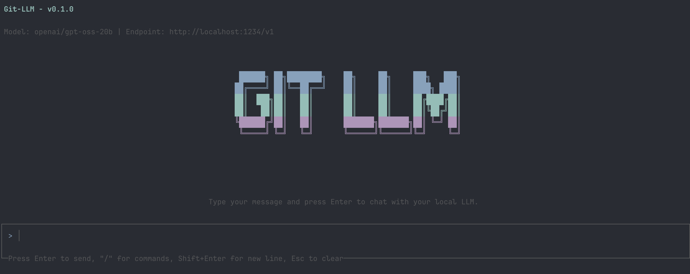

# Git LLM

An LLM-powered Git assistant with chat interface. Provides intelligent Git operations and code assistance through a conversational interface using LM-Studio or Ollama.



## Demo


## Features

- 🤖 **LLM-Powered Git Operations** - Intelligent Git commands with context awareness
- 💬 **Interactive Chat Interface** - Conversational Git assistance powered by React and Ink
- 🔧 **LLM Provider Support** - Support for LM-Studio and Ollama
- 🚀 **Smart Workflows** - Automated Git workflows with LangGraph
- 🛠️ **Code Review** - AI-powered code analysis and suggestions
- 📊 **Rich UI** - Beautiful terminal interface with markdown rendering
- 🔒 **Privacy First** - All processing runs with your own models
- ⚡ **No API Costs** - Use your own models, no external API calls

## Quick Start

```bash
npx git-llm
```

## Installation

### Global Installation
```bash
npm install -g git-llm
gitllm
```

### Local Usage
```bash
npx git-llm
```

## Configuration

Set environment variables to configure your preferred LLM provider:

### LM-Studio (Default)
```bash
export GIT_LLM_PROVIDER="lm-studio"
export GIT_LLM_MODEL="openai/gpt-oss-20b"
export GIT_LLM_BASE_URL="http://localhost:1234/v1"
```

### Ollama
```bash
export GIT_LLM_PROVIDER="ollama"
export GIT_LLM_MODEL="gpt-oss-20b"
export GIT_LLM_BASE_URL="http://localhost:11434"
```

## Usage

Once running, you can interact with Git LLM using natural language:

- "Show me the current status"
- "Create a commit with these changes"
- "Help me review this code"
- "What branches do I have?"
- "Explain this diff"

## License

MIT
