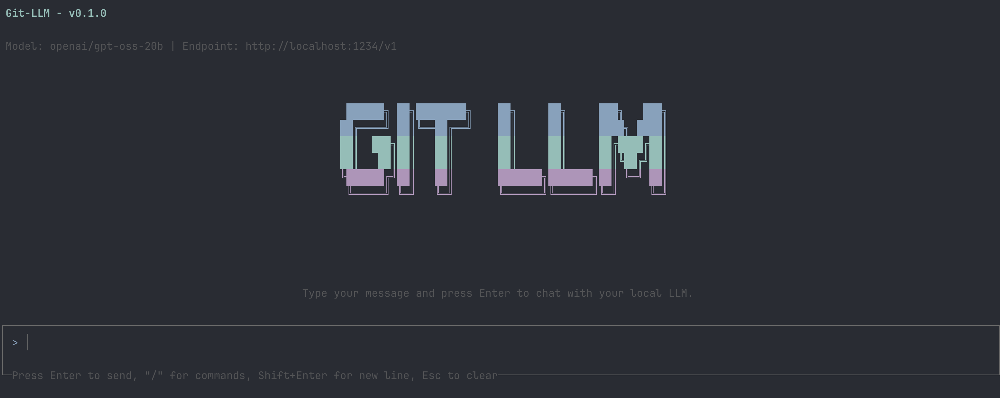

# Git LLM

An LLM-powered Git assistant with chat interface. Provides intelligent Git operations and code assistance through a conversational interface using LM-Studio or Ollama.



## Demo


## Features

- 🤖 **LLM-Powered Git Operations** - Intelligent Git commands with context awareness
- 💬 **Interactive Chat Interface** - Conversational Git assistance powered by React and Ink
- 🔧 **LLM Provider Support** - Support for LM-Studio and Ollama
- 🚀 **Smart Workflows** - Automated Git workflows with LangGraph
- 🛠️ **Code Review** - AI-powered code analysis and suggestions
- 📊 **Rich UI** - Beautiful terminal interface with markdown rendering
- 🔒 **Privacy First** - All processing runs with your own models
- ⚡ **No API Costs** - Use your own models, no external API calls

## Quick Start

```bash
npx git-llm
```

## Installation

### Global Installation
```bash
npm install -g git-llm
gitllm
```

### Local Usage
```bash
npx git-llm
```

## Configuration

Set environment variables to configure your preferred LLM provider:

### LM-Studio (Default)
```bash
export GIT_LLM_PROVIDER="lm-studio"
export GIT_LLM_MODEL="openai/gpt-oss-20b"
export GIT_LLM_BASE_URL="http://localhost:1234/v1"
```

### Ollama
```bash
export GIT_LLM_PROVIDER="ollama"
export GIT_LLM_MODEL="gpt-oss-20b"
export GIT_LLM_BASE_URL="http://localhost:11434"
```

## Usage

Once running, you can interact with Git LLM using natural language:

- "Show me the current status"
- "Create a commit with these changes"
- "Help me review this code"
- "What branches do I have?"
- "Explain this diff"

## Git Actions

Git LLM provides smooth git actions with common usage patterns for everyday workflows:

### Quick Operations
```bash
quick-save, qs [msg]    # Stage all + commit (auto message if none)
quick-push, qp [msg]    # Stage all + commit + push
save <message>          # Stage all + commit with message
wip                     # Quick save with "WIP" message
```

### Sync Operations
```bash
sync                    # Fetch + merge from origin
sync-rebase, sr         # Fetch + rebase from origin
pull                    # Pull from origin
push [force]            # Push to origin
fetch                   # Fetch all remotes + prune
```

### Branch Workflows
```bash
feature, feat <name>    # Create feature branch from main
hotfix, fix <name>      # Create hotfix branch from main
release <version>       # Create release branch
finish                  # Merge current branch into main
update                  # Rebase current branch onto main
```

### History & Inspection
```bash
history, log [n]        # Show recent commits (default: 10)
last                    # Show last commit details
blame <file>            # Show file blame
show [ref]              # Show commit details
search <query>          # Search commit messages
contributors            # Show all contributors
```

### Undo Operations
```bash
undo                    # Soft reset last commit
unstage [file]          # Unstage files
discard [file]          # Discard changes
reset <file>            # Reset file to HEAD
amend [msg]             # Amend last commit
oops                    # Amend last commit (no message change)
```

### Cleanup & Maintenance
```bash
clean                   # Preview untracked files
clean-branches, cb      # Delete merged branches
prune                   # Prune stale remote branches
gc                      # Garbage collect repository
```

### Tagging
```bash
tag <name> [msg]        # Create tag (annotated if msg provided)
tags                    # List all tags
delete-tag, dt <name>   # Delete local tag
```

### Advanced Operations
```bash
cherry-pick, cp <hash>  # Cherry-pick a commit
squash <n>              # Help to squash n commits
info                    # Show repository info
whoami                  # Show git user config
remote                  # Show remote URLs
```

### Examples

```bash
# Quick workflow
"qs"                     # Quick save with auto message
"qp fix: resolve bug"    # Quick push with message

# Feature development
"feature login"          # Create feature/login branch
"finish"                 # Merge to main when done

# Daily operations
"sync"                   # Update from origin
"history 20"             # View last 20 commits
"clean-branches"         # Remove merged branches
```

## License

MIT
